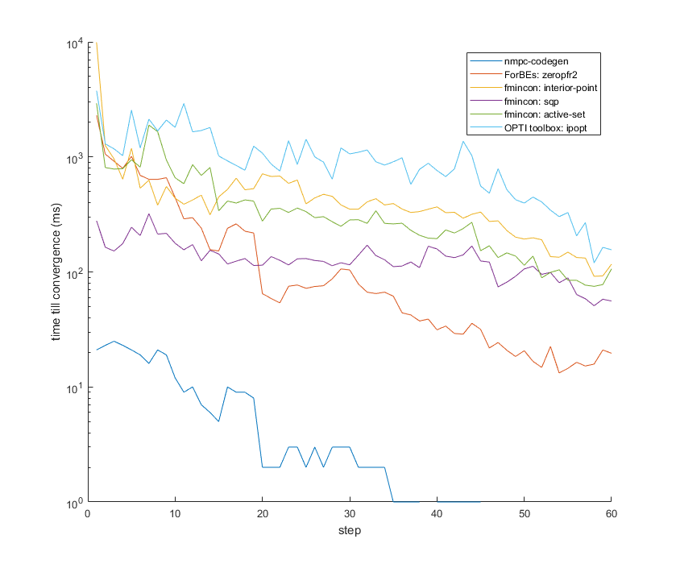

# PANOC NMPC solver kernel 
## What is this?
Nmpc-codegen generates MPC controllers. The user provides the dynamics of the system, a number of conditions and some MPC parameters in python. Nmpc-codegen will then generate the NMPC controller in c89 code that can be used on embedded devices. Check out the [website](https://kul-forbes.github.io/nmpc-codegen/) for more information.

This repo only contains the C code used with the code generation and the documentation. Nmpc-codegen has 2 implementations one in Matlab and one in Python. 

- [nmpc-codegen-matlab](https://github.com/kul-forbes/nmpc-codegen-matlab) github repo
- [nmpc-codegen-python](https://github.com/kul-forbes/nmpc-codegen-python) github repo

If you want to use this library for research feel free to contact willem.melis at outlook dot com.

## How to compile and test me? (for internal developers)
This is only for those who want to check if the library works on there device. 
### Windows with Mingw/Mingw-W64 (!!! make sure python and the toolchain are either BOTH 32 or BOTH 64 bit)
- Generate the test functions by running the generate_test_files.py script with python3
- Run Cmake to generate the make files: cmake -H. -Bbuild -G "MinGW Makefiles"
- Run Make to compile everything: make
- Run make test to test everything: make test

## Notes for internal developers
- The tested compilers on the raw controller code are gcc GNU compiler, Clang LLVM compiler, Intel C compiler and the Microsoft C Compiler.
- cmake -H. -Bbuild -DCMAKE_C_COMPILER=clang creates a build system with clang compiler and Cmake