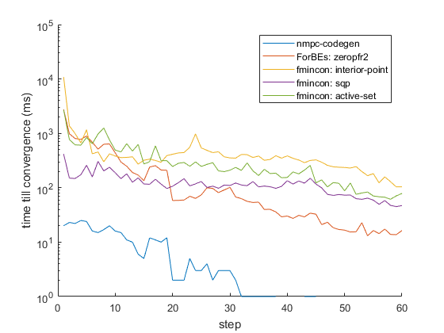

# Nmpccodegen library

## What is this?
This project is still under construction but the goal is to generate an MPC controller. The user will provide the dynamics of the system, a number of conditions and some MPC parameters in python. The program will then generate an NMPC controller in C code that that is close to C89 so it can be executed on embedded devices.

Below you can find a comparison between the Matlab implementation (ForBes zerofpr2) fmincon(interior point method of matlab) and nmpc-codegen. The time represents the time till convergence in milliseconds of every step of the controller simulation.(source code: ./demos/Matlab/compare_libs.m).

The first version of Python is ready to be used, a Matlab version is on its way, right now its experimental.(run ./demos/thesis/TwoCircTrailer.py in the github repo to get an idea what this is about)

At the moment there is no package, but very soon the python package will be available in pip.

## Installation Instructions (Windows/Mac OS/Linux)

- [Install with Python3](./install/Python_install.md)
- [Install with Matlab](./install/Matlab_install.md)
